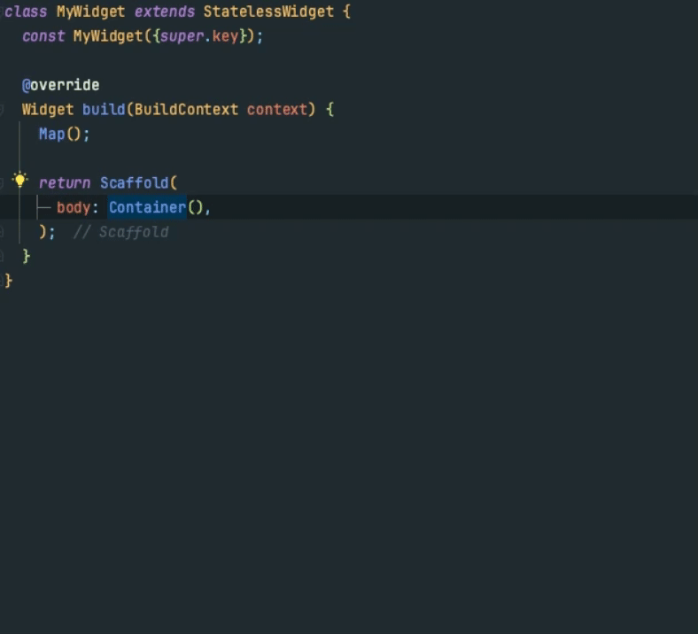

mobx_lint is a developer tool for users of mobx, designed to help stop common issues and simplify repetitive tasks.

mobx_lint adds various warnings with quick fixes and refactoring options, such as:

- Refactor wrap a widget with Observer

## Installing mobx_lint

mobx_lint is implemented using [custom_lint]. As such, it uses custom_lint's installation logic.  
Long story short:

- Add both mobx_lint and custom_lint to your `pubspec.yaml`:
  ```yaml
  dev_dependencies:
    custom_lint:
    mobx_lint:
  ```
- Enable `custom_lint`'s plugin in your `analysis_options.yaml`:

  ```yaml
  analyzer:
    plugins:
      - custom_lint
  ```

## Running mobx_lint in the terminal/CI

Custom lint rules created by mobx_lint may not show-up in `dart analyze`.
To fix this, you can run a custom command line: `custom_lint`.

Since your project should already have custom_lint installed
(cf [installing mobx_lint](#installing-mobx_lint)), then you should be
able to run:

```sh
dart run custom_lint
```

Alternatively, you can globally install `custom_lint`:

```sh
# Install custom_lint for all projects
dart pub global activate custom_lint
# run custom_lint's command line in a project
custom_lint
```

## All assists

### Wrap widgets with a `Observer`


