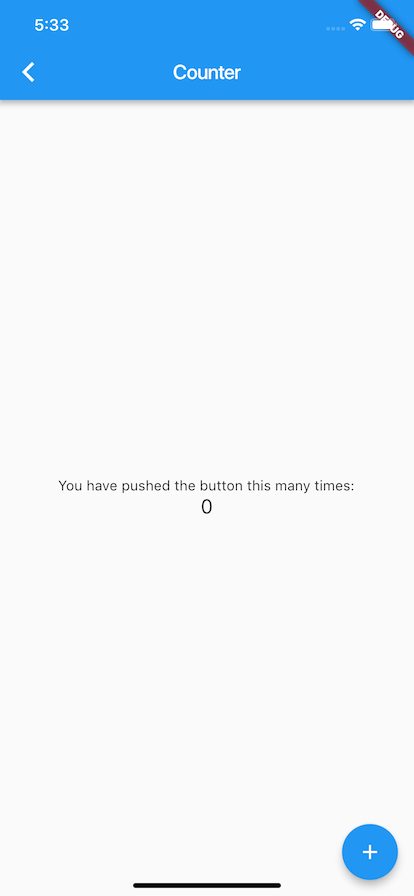

# Flutter

For this tutorial, we will start with a slightly modified version of the example created from `flutter create`.

```dart
class CounterExample extends StatefulWidget {
  CounterExample({Key key}) : super(key: key);

  @override
  _CounterExampleState createState() => _CounterExampleState();
}

class _CounterExampleState extends State<CounterExample> {
  int _counter = 0;

  void _incrementCounter() {
    setState(() {
      _counter++;
    });
  }

  @override
  Widget build(BuildContext context) {
    return Scaffold(
      appBar: AppBar(
        title: Text('Counter'),
      ),
      body: Center(
        child: Column(
          mainAxisAlignment: MainAxisAlignment.center,
          children: <Widget>[
            Text(
              'You have pushed the button this many times:',
            ),
            Text(
              '$_counter',
              style: Theme.of(context).textTheme.display1,
            ),
          ],
        ),
      ),
      floatingActionButton: FloatingActionButton(
        onPressed: _incrementCounter,
        tooltip: 'Increment',
        child: Icon(Icons.add),
      ),
    );
  }
}

```

## Installation

Add the following dependencies to your pubspec.yaml

```yaml
dependencies:
  mobx: <latest version>
  flutter_mobx: <latest version>
```

Next add the following dev dependencies

```yaml
dev_dependencies:
  build_runner: ^1.0.0
  mobx_codegen: <latest version>
```

## Adding a Store

First, let's create a store.

```dart
import 'package:mobx/mobx.dart';

// Include generated file
part 'counter.g.dart';

// This is the class used by rest of your codebase
class Counter = CounterBase with _$Counter;

// The store-class
abstract class CounterBase implements Store {
  @observable
  int value = 0;

  @action
  void increment() {
    value++;
  }
}
```

Then we will run `flutter packages pub run build_runner build` to build the class that will be used by the rest of our codebase.

## Add Store & Observer to Widget

Finally, we will add the Counter store to our CounterExample. We will also wrap the UI that should re-render on store updates with the Observer widget.

```dart
class CounterExample extends StatefulWidget {
  CounterExample({Key key}) : super(key: key);

  @override
  _CounterExampleState createState() => _CounterExampleState();
}

class _CounterExampleState extends State<CounterExample> {
  final _counter = Counter();

  @override
  Widget build(BuildContext context) => Scaffold(
        appBar: AppBar(
          title: Text('Counter'),
        ),
        body: Center(
          child: Column(
            mainAxisAlignment: MainAxisAlignment.center,
            children: <Widget>[
              Text(
                'You have pushed the button this many times:',
              ),
              Observer(
                  builder: (_) => Text(
                        '${_counter.value}',
                        style: TextStyle(fontSize: 20),
                      )),
            ],
          ),
        ),
        floatingActionButton: FloatingActionButton(
          onPressed: _counter.increment,
          tooltip: 'Increment',
          child: Icon(Icons.add),
        ),
      );
}
```

Our end result will look exactly the same as our start!


